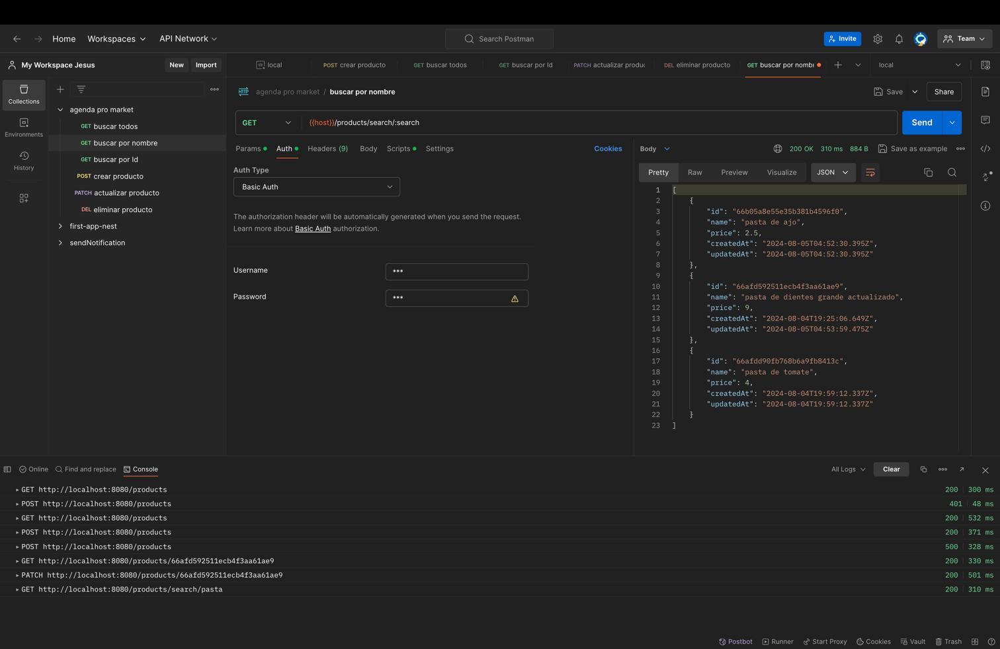

# Products CRUD 

## Overview

This project is using the following modules:

- Java 21
- Spring Boot 3.3.2
- MongoDB


---

### Run Test
```
gradle test
```
view jacoco report

### Environments

Create Database in MongoDB and setting environments with

```
export MONGO_URI=mongodb+srv://<user_example>:<password>@<cluster>/<database>
export MONGO_USER=<user_example>
export MONGO_DB=<database>
export SPRING_SECURITY_USER_NAME=<user_api>
export SPRING_SECURITY_USER_PASSWORD=<user_pass>
```


---


### Basic Auth
Use Basic Auth with credential in environments

username is SPRING_SECURITY_USER_NAME

password is SPRING_SECURITY_USER_PASSWOR


#### Curl Example Create Product
````
curl --location 'http://localhost:8080/products' \
--header 'Content-Type: application/json' \
--header 'Authorization: Basic *****' \
--data '{
	"name": "pasta de ajo",
    "price": 2.5
}'
````
### Product Service

| HTTP Method | URL                                            | Description          |
|-------------|------------------------------------------------|----------------------|
| `POST`      | http://localhost:8080/products                 | Create new product   |
| `PATCH`     | http://localhost:8080/products/{productId}        | Update Product by ID |
| `GET`       | http://localhost:8080/products                 | Get all Products     |
| `GET`       | http://localhost:8080/products/{productId}        | Get Product by ID    |
| `GET`       | http://localhost:8080/products/search/{search} | Get Products by name |
| `DELETE`    | http://localhost:8080/products/{productId}        | Delete Product by ID |
